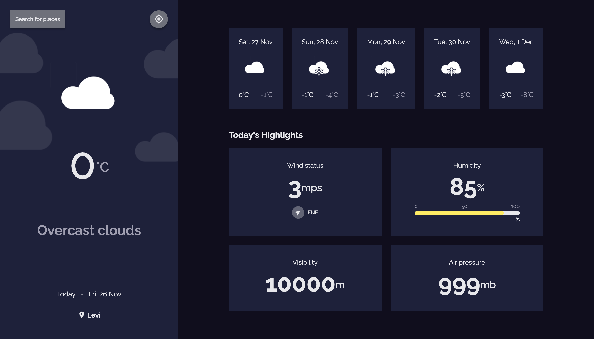

<!-- Please update value in the {}  -->

<h1 align="center">Weather App</h1>

<div align="center">
   Solution for a challenge from  <a href="http://devchallenges.io" target="_blank">Devchallenges.io</a>.
</div>

<div align="center">
  <h3>
    <a href="https://evening-waters-15565.herokuapp.com/">
      Demo
    </a>
    <span> | </span>
    <a href="https://github.com/karokosmos/weather-app">
      Solution
    </a>
    <span> | </span>
    <a href="https://devchallenges.io/challenges/mM1UIenRhK808W8qmLWv">
      Challenge
    </a>
  </h3>
</div>

<!-- TABLE OF CONTENTS -->

## Table of Contents

- [Overview](#overview)
  - [Built With](#built-with)
- [Features](#features)
- [How to use](#how-to-use)
- [Contact](#contact)
- [Acknowledgements](#acknowledgements)

<!-- OVERVIEW -->

## Overview



Another DevChallenge made with React! I've been studying some Redux lately and I wanted to test it out in this project. In my opinion this was a very nice app to build even though the theme is quite basic. :D

### Built With

<!-- This section should list any major frameworks that you built your project using. Here are a few examples.-->

- [React](https://reactjs.org/)
- [Redux](https://redux.js.org/)

## Features

<!-- List the features of your application or follow the template. Don't share the figma file here :) -->

Weather location defaults to Helsinki, but you can also get your local weather with geolocation and search for cities. Unfortunately there's no autocomplete for cities yet, so please use full city name for the search feature. Suggestions for free autocomplete APIs appreciated!

This application/site was created as a submission to a [DevChallenges](https://devchallenges.io/challenges) challenge. The [challenge](https://devchallenges.io/challenges/mM1UIenRhK808W8qmLWv) was to build an application to complete the given user stories.

## How To Use

<!-- Example: -->

To clone and run this application, you'll need [Git](https://git-scm.com) and [Node.js](https://nodejs.org/en/download/) (which comes with [npm](http://npmjs.com)) installed on your computer. From your command line:

```bash
# Clone this repository
$ git clone https://github.com/karokosmos/weather-app

# Install dependencies
$ npm install

# Run the app
$ npm start
```

## Acknowledgements

<!-- This section should list any articles or add-ons/plugins that helps you to complete the project. This is optional but it will help you in the future. For example: -->

- [Fullstack open 2021 course](https://fullstackopen.com/)
- [OpenWeather API](https://openweathermap.org/)
- [Heroku](https://www.heroku.com/)

## Contact

- GitHub [@karokosmos](https://github.com/karokosmos)
